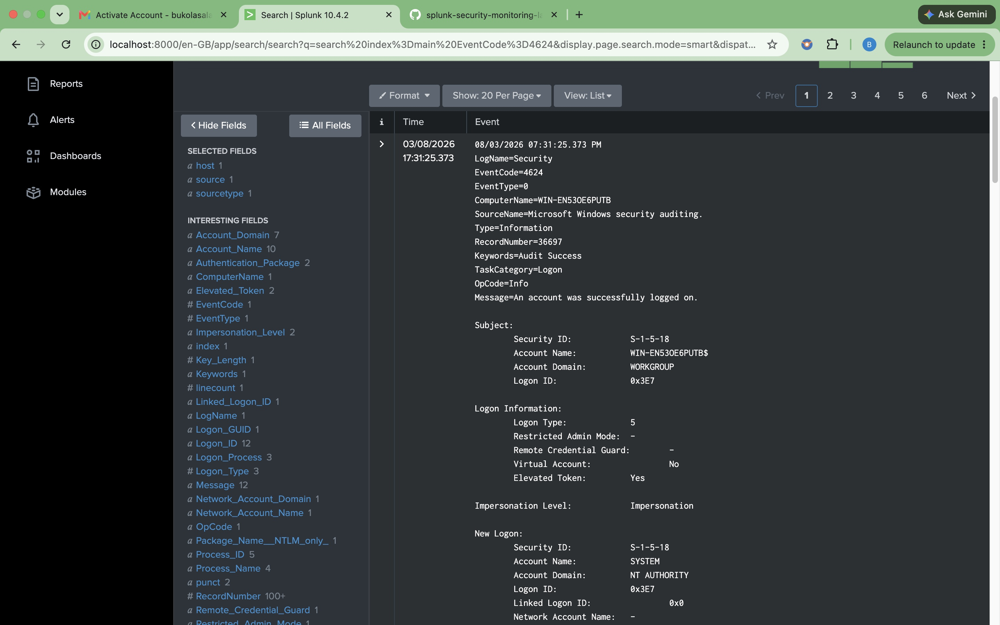

# Detection: Successful Logon (Event ID 4624)

## Detection Objective

Detect successful user authentication events on Windows endpoints to monitor user activity, establish authentication timelines, and identify unusual or unauthorized login behavior.

---

## Description

Windows Event ID **4624** is generated whenever a user, service, or system successfully authenticates to a Windows device. This event is one of the most frequently used security events during incident response because it provides visibility into who logged in, when they logged in, how they authenticated, and from which workstation.

Monitoring successful logons enables security analysts to establish normal authentication patterns and detect suspicious activity such as unauthorized access, unusual login locations, or privileged account usage.

---

## Data Source

- Splunk Enterprise
- Windows Security Event Log
- Splunk Universal Forwarder

---

## SPL Detection Query

```spl
index=main EventCode=4624
| table _time host Account_Name Logon_Type EventCode
| sort - _time
```

---

## Expected Results

The search returns successful Windows authentication events including:

- Timestamp
- Hostname
- Username
- Logon Type
- Event Code (4624)

---

## Investigation Guide

When investigating Event ID 4624, analysts should verify:

- Is the user expected to access this system?
- Did the login occur during normal business hours?
- Is the logon type expected (Interactive, Network, RDP, Service)?
- Are there multiple successful logons from different systems?
- Is the account privileged?

Correlate this event with:

- Event ID 4634 (Logoff)
- Event ID 4672 (Special Privileges Assigned)
- Event ID 4648 (Explicit Credentials)

---

## MITRE ATT&CK

| Technique | ID |
|-----------|----|
| Valid Accounts | T1078 |

---

## Screenshot



---

## Skills Demonstrated

- Splunk Search Processing Language (SPL)
- Windows Authentication Monitoring
- Security Event Analysis
- Log Investigation
- SIEM Detection Engineering
