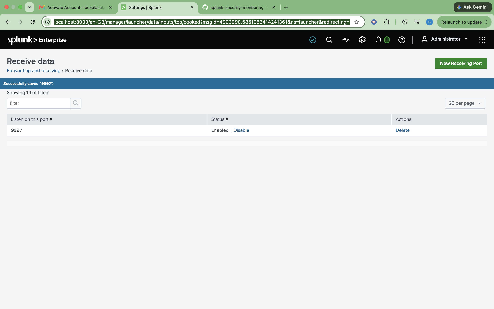

# Phase 2 – Configure Log Ingestion

## Objective

Configure Splunk Enterprise to receive Windows security logs from the Splunk Universal Forwarder.

---

## Implementation Steps

1. Logged in to Splunk Enterprise.
2. Navigated to **Settings > Forwarding and Receiving**.
3. Selected **Configure Receiving**.
4. Created a new receiving port.
5. Configured TCP port **9997**.
6. Verified that the receiving port was enabled.

---

## Why Port 9997?

Port **9997** is the default port used by the Splunk Universal Forwarder to securely send logs to a Splunk Enterprise server.

---

## Result

Splunk Enterprise is now configured to receive incoming data from remote systems through TCP port **9997**.

---

## Evidence

The screenshot below confirms that TCP port **9997** has been successfully configured and enabled.

---

## Skills Demonstrated

- Splunk Enterprise Administration
- Splunk Forwarding and Receiving
- Log Ingestion Configuration
- Security Monitoring
- SIEM Configuration
- Technical Documentation

---

## Lessons Learned

During this phase, I learned how Splunk Enterprise receives logs from remote systems using TCP port **9997**. This configuration forms the foundation for centralized log collection and security monitoring.

---

## Next Step

Install the Splunk Universal Forwarder on the Windows 11 virtual machine and configure it to forward Windows Event Logs to Splunk Enterprise.
