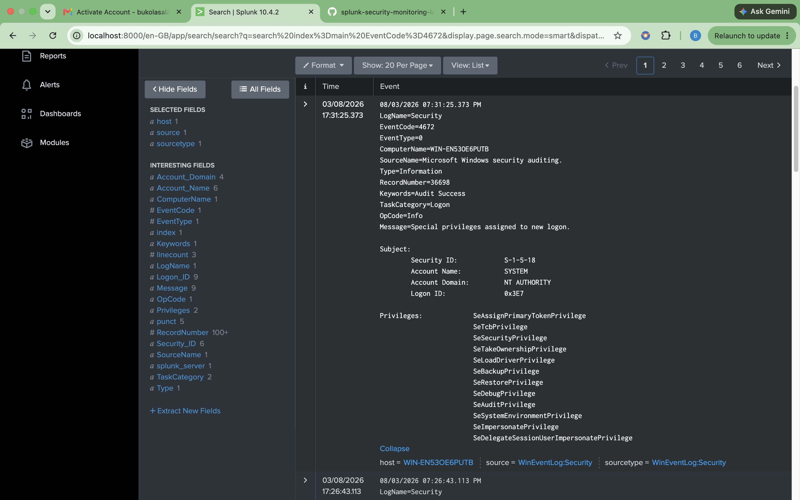
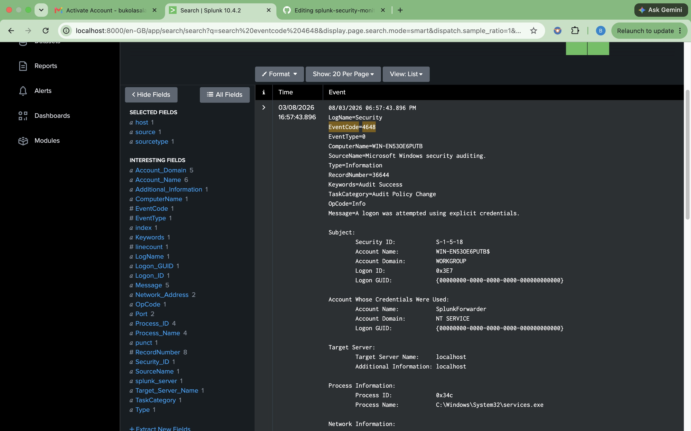
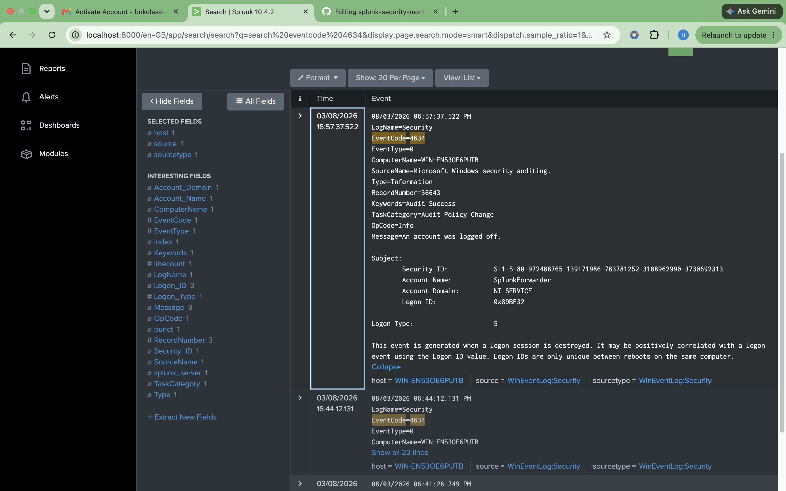

## Evidence

### Universal Forwarder Installed

The Splunk Universal Forwarder service was successfully installed and configured on the Windows 11 endpoint. The Windows Services console confirms that the **SplunkForwarder** service is running with an **Automatic** startup type, ensuring that log collection continues automatically after system reboots. This verifies that the endpoint is ready to collect and forward Windows Event Logs to the Splunk Enterprise server.

---
### Windows Security Events

Windows Security Event Logs were successfully ingested into Splunk Enterprise and indexed in the **main** index. Searches returned multiple security events, including successful logons (Event ID **4624**), privileged logons (Event ID **4672**), logoff events (Event ID **4634**), and explicit credential usage (Event ID **4648**). This confirms that the end-to-end log collection pipeline—from the Windows endpoint, through the Universal Forwarder, to Splunk Enterprise—is functioning correctly.

## Event ID 4624 – Successful Logon

Event ID **4624** records a successful user authentication on a Windows system. This event is generated whenever a user or service successfully logs on and is one of the most frequently analyzed security events during incident investigations.

Monitoring Event ID 4624 enables security analysts to:

- Verify successful user authentication
- Identify interactive, network, or remote logons
- Correlate user activity with other security events
- Establish authentication timelines during investigations
- Detect unusual login patterns and potential unauthorized access

In this lab, Splunk successfully ingested Event ID 4624 from the Windows endpoint, confirming that authentication events were collected and indexed correctly.

---

## Event ID 4672 – Special Privileges Assigned to New Logon

Event ID **4672** is generated when a user logs on with administrative or other highly privileged rights. This event is commonly associated with administrator accounts and privileged service accounts.

Monitoring Event ID 4672 helps security analysts:

- Detect privileged account activity
- Identify administrative logins
- Monitor the use of elevated permissions
- Investigate potential privilege escalation attempts
- Correlate privileged logons with authentication events such as Event ID 4624

During this lab, Splunk successfully collected and indexed Event ID 4672, demonstrating the ability to monitor privileged authentication activity from the Windows endpoint

## Event ID 4648 – Logon Using Explicit Credentials

Event ID **4648** is generated when a user or process attempts to log on using credentials that are explicitly provided rather than the credentials of the currently logged-on user. This event commonly occurs when administrative tools, remote management utilities, scheduled tasks, or applications authenticate using alternate credentials.

Monitoring Event ID 4648 enables security analysts to:

- Identify the use of alternate or explicit credentials
- Detect potential lateral movement between systems
- Monitor administrative and remote management activities
- Investigate suspicious authentication attempts
- Correlate credential usage with other security events during incident investigations

In this lab, Splunk successfully ingested Event ID 4648 from the Windows endpoint, confirming that explicit credential authentication events were collected and indexed correctly.

---

## Event ID 4634 – User Logoff

Event ID **4634** is generated when a user logs off from a Windows system, indicating that a logon session has ended. This event helps complete the authentication lifecycle by identifying when user sessions are terminated.

Monitoring Event ID 4634 enables security analysts to:

- Track user session termination
- Correlate logoff events with successful logons (Event ID 4624)
- Build user activity timelines during investigations
- Identify abnormal session durations
- Support forensic analysis by reconstructing user activity

In this lab, Splunk successfully collected and indexed Event ID 4634, demonstrating the ability to monitor user session activity and correlate authentication events from the Windows endpoint.
