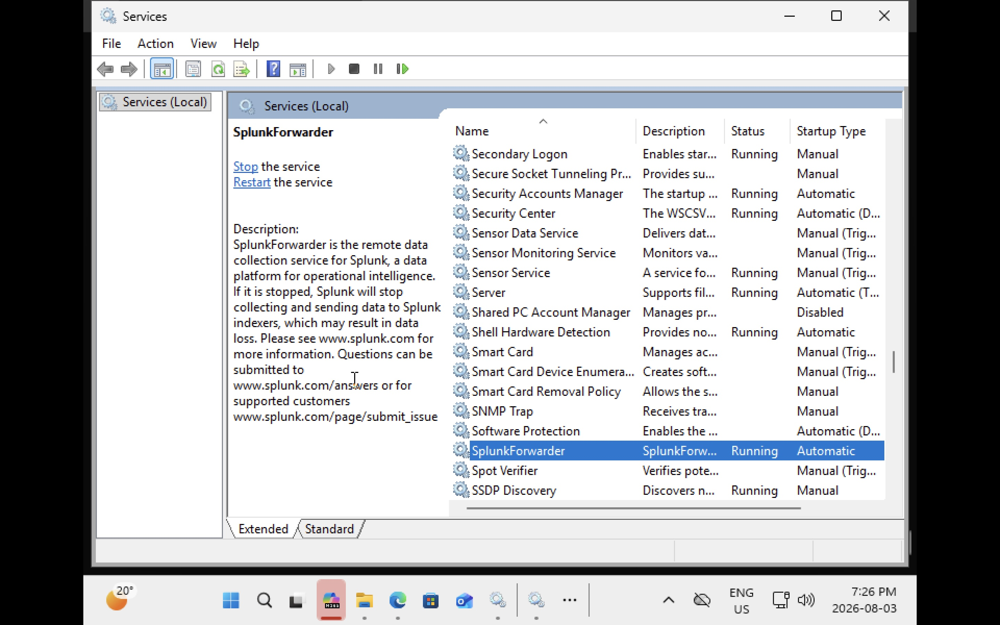

## Evidence

### Universal Forwarder Installed

The Splunk Universal Forwarder service was successfully installed and configured on the Windows 11 endpoint. The Windows Services console confirms that the **SplunkForwarder** service is running with an **Automatic** startup type, ensuring that log collection continues automatically after system reboots. This verifies that the endpoint is ready to collect and forward Windows Event Logs to the Splunk Enterprise server.
essfully collected and indexed Event ID 4634, demonstrating the ability to monitor user session activity and correlate authentication events from the Windows endpoint.
