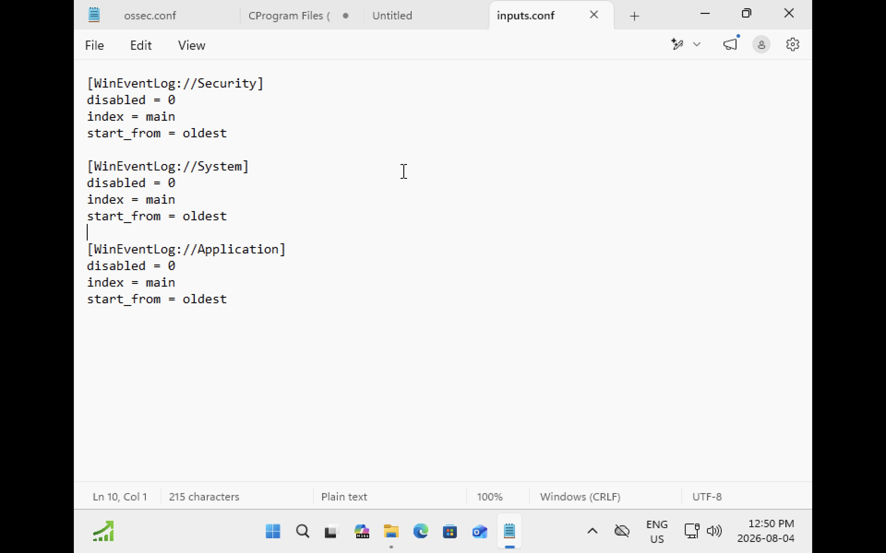
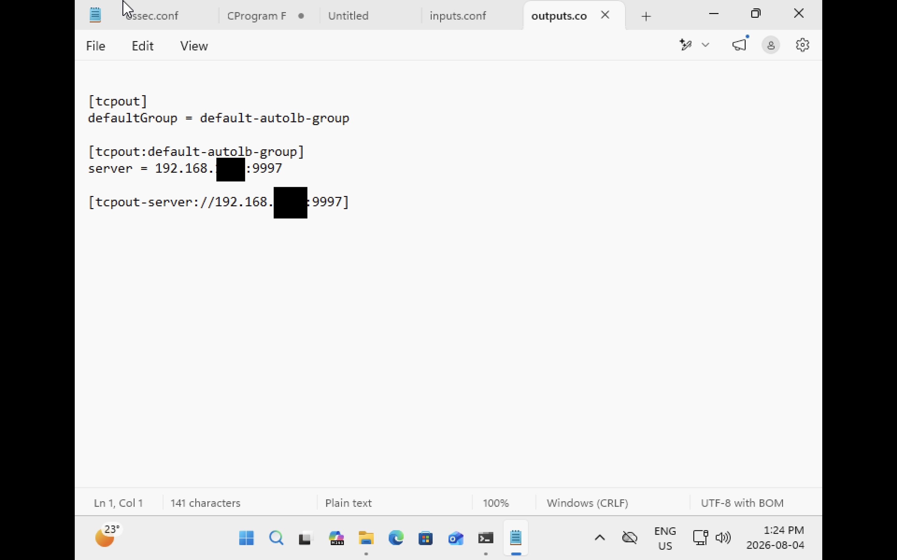
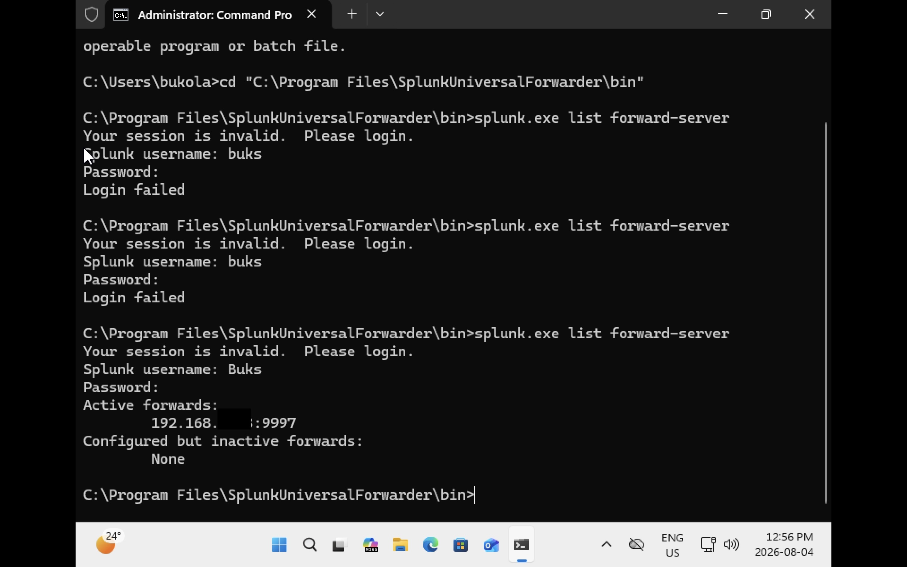
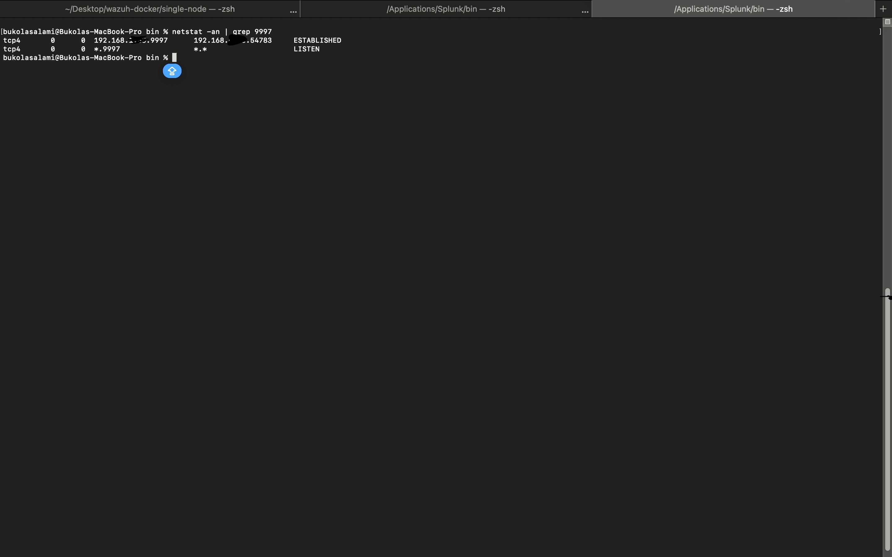

## Evidence

### Universal Forwarder Installation

### Objective

Deploy the Splunk Universal Forwarder on a Windows 11 endpoint to collect Windows Event Logs and securely forward them to the Splunk Enterprise server for centralized monitoring and analysis.

### Installation Summary

The Splunk Universal Forwarder was successfully installed on the Windows 11 virtual machine. After installation, the **SplunkForwarder** Windows service was configured to start automatically and verified to be in the **Running** state using the Windows Services console.

Running the service with an **Automatic** startup type ensures that log collection resumes automatically whenever the system restarts, providing continuous monitoring without manual intervention.

### Verification

The installation was verified by confirming that:

- The **SplunkForwarder** service was installed successfully.
- The service status was **Running**.
- The startup type was set to **Automatic**.
- The endpoint was ready to collect and forward Windows Event Logs.

### Skills Demonstrated

- Splunk Universal Forwarder Deployment
- Windows Service Administration
- Endpoint Log Collection
- SIEM Infrastructure Configuration
- Windows Endpoint Management


The Splunk Universal Forwarder service was successfully installed and configured on the Windows 11 endpoint. The Windows Services console confirms that the **SplunkForwarder** service is running with an **Automatic** startup type, ensuring that log collection continues automatically after system reboots. This verifies that the endpoint is ready to collect and forward Windows Event Logs to the Splunk Enterprise server.

## Configure `inputs.conf`

### Objective

Configure the Splunk Universal Forwarder to monitor and collect Windows Event Logs from the Windows 11 endpoint for centralized security monitoring in Splunk Enterprise.

### Configuration Summary

The `inputs.conf` file was created to define the Windows Event Logs that the Universal Forwarder should collect. Three primary Windows log sources were configured:

- Security
- System
- Application

These logs provide visibility into authentication events, operating system activity, and application behavior, enabling security monitoring and incident investigation.

### Configuration




### Configuration Details

| Setting | Purpose |
|----------|---------|
| `WinEventLog://Security` | Collects Windows Security events such as logons, logoffs, privilege assignments, and authentication activity. |
| `WinEventLog://System` | Collects operating system events, including service activity, driver events, and system startup or shutdown information. |
| `WinEventLog://Application` | Collects application-generated events that assist with troubleshooting and monitoring application behavior. |
| `disabled = 0` | Enables log collection for the specified event log. |
| `index = main` | Stores collected events in the **main** index within Splunk Enterprise. |
| `start_from = oldest` | Begins collecting events from the oldest available record, ensuring historical events are ingested during the initial configuration. |

### Outcome

After configuring `inputs.conf`, the Splunk Universal Forwarder successfully monitored the configured Windows Event Logs and forwarded them to Splunk Enterprise for indexing, searching, and security analysis.

### Skills Demonstrated

- Splunk Universal Forwarder Configuration
- Windows Event Log Collection
- SIEM Data Ingestion
- Windows Security Monitoring
- Endpoint Log Collection
## Configure `outputs.conf`

### Objective

Configure the Splunk Universal Forwarder to send collected Windows Event Logs to the Splunk Enterprise server.

### Configuration Summary

The `outputs.conf` file was configured to define the destination for forwarded log data. This configuration directs the Universal Forwarder to transmit Windows Event Logs to the Splunk Enterprise receiving port over TCP.


### Configuration

### Configuration Details

| Setting | Purpose |
|----------|---------|
| `[tcpout]` | Defines the global TCP forwarding configuration for the Universal Forwarder. |
| `defaultGroup = splunk_indexer` | Specifies the default forwarding group that the Universal Forwarder will use to send collected logs. |
| `[tcpout:splunk_indexer]` | Creates a forwarding group named **splunk_indexer** that contains the destination Splunk Enterprise server. |
| `server = <Splunk-Server-IP>:9997` | Specifies the Splunk Enterprise server and receiving port that will receive forwarded Windows Event Logs. Port **9997** is the default receiving port configured on the Splunk Enterprise server. |

### Outcome

After configuring `outputs.conf`, the Splunk Universal Forwarder successfully established communication with the Splunk Enterprise server and forwarded Windows Event Logs over TCP port **9997**. This enabled centralized log collection, indexing, and security monitoring within Splunk Enterprise.

```

> **Note:** The Splunk server IP address has been replaced with a placeholder for security purposes.


### Skills Demonstrated

- Splunk Universal Forwarder Configuration
- Log Forwarding Configuration
- SIEM Administration
- TCP Network Configuration
- Endpoint Log Collection
## Windows Forwarder Connected



### Objective

Verify that the Splunk Universal Forwarder running on the Windows 11 endpoint has successfully established a connection with the Splunk Enterprise server.


## Connection Verification




After configuring the Splunk Universal Forwarder, network connectivity between the Windows 11 endpoint and the Splunk Enterprise server was verified using the `netstat` command.

The output confirmed:

- **LISTEN** – Splunk Enterprise is actively listening for incoming connections on TCP port **9997**.
- **ESTABLISHED** – An active TCP session exists between the Windows 11 endpoint (running the Splunk Universal Forwarder) and the Splunk Enterprise server, confirming that the forwarder successfully established a connection to the indexer.

This verification demonstrates that the communication channel required for forwarding Windows Event Logs is operational and that the Splunk Enterprise server is ready to receive security events for indexing and analysis.

### Verification Output

```text
tcp4  <Splunk-Server-IP>.9997     <Windows-Endpoint-IP>.54783     ESTABLISHED
tcp4  *.9997                      *.*                             LISTEN
```

> **Note:** Private IP addresses have been masked for security and privacy purposes.
