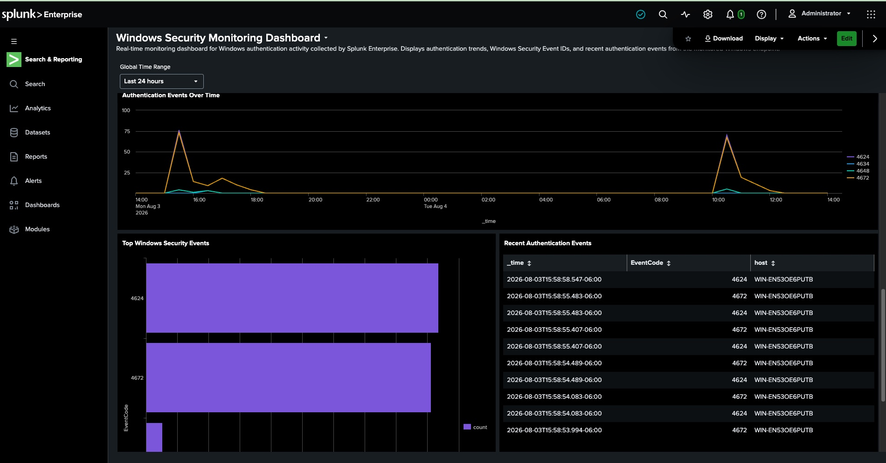
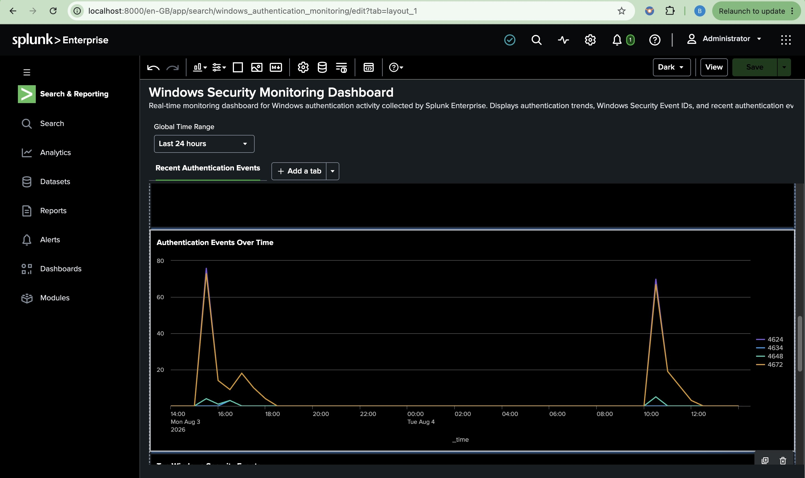
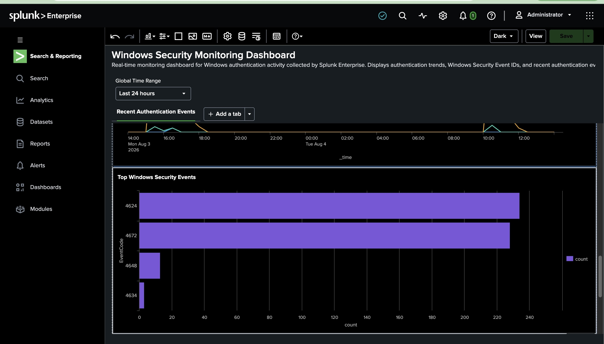
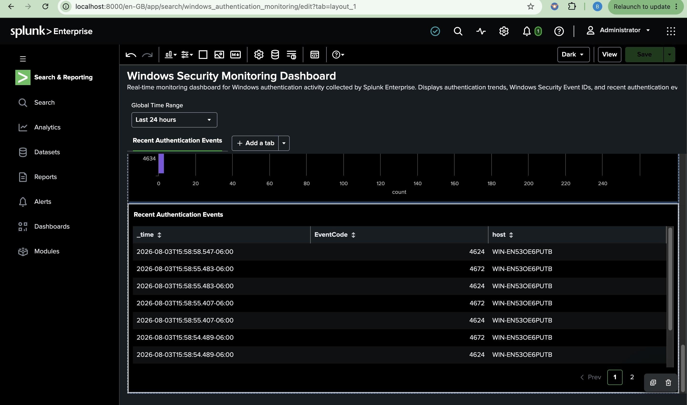

# Phase 5 – Windows Security Monitoring Dashboard

## Overview

In this phase, a Windows Security Monitoring Dashboard was developed using Splunk Dashboard Studio to visualize Windows Security Event Logs collected from the monitored Windows 11 endpoint.

The dashboard provides real-time visibility into Windows authentication activity by displaying authentication trends, security event frequency, and recent authentication events. These visualizations enable security analysts to quickly identify suspicious activity, investigate authentication events, and monitor endpoint security.

---

## Objectives

- Create a centralized Windows Security monitoring dashboard.
- Visualize authentication activity over time.
- Monitor the frequency of Windows Security Event IDs.
- Display recent authentication events for investigation.
- Demonstrate the use of Splunk Dashboard Studio for security monitoring.

---

## Dashboard Overview

The dashboard consists of three visualizations designed to provide visibility into Windows authentication activity.

### Dashboard Overview



The dashboard combines multiple visualizations into a single interface, allowing analysts to monitor authentication activity without manually running searches. It provides both historical trends and real-time event visibility.

---

## Authentication Events Over Time



### Purpose

This visualization displays authentication-related Windows Security Events over time.

### Monitored Event IDs

| Event ID | Description |
|----------|-------------|
| 4624 | Successful Logon |
| 4634 | User Logoff |
| 4648 | Logon Using Explicit Credentials |
| 4672 | Special Privileges Assigned to New Logon |

### Security Value

This visualization helps security analysts:

- Monitor authentication activity over time.
- Identify spikes in logon activity.
- Correlate authentication events during investigations.
- Detect unusual login behavior.
- Observe privileged account activity.

---

## Top Windows Security Events



### Purpose

This chart displays the total number of collected Windows Security Events grouped by Event ID.

### Security Value

This visualization enables analysts to:

- Identify the most common security events.
- Understand authentication activity distribution.
- Monitor privileged logons.
- Detect unusual increases in specific event types.
- Establish normal authentication baselines.

---

## Recent Authentication Events



### Purpose

This table displays the most recent authentication-related Windows Security Events collected by Splunk.

### Displayed Fields

- Time
- Event ID
- Host

### Security Value

This table enables security analysts to:

- Review recent authentication activity.
- Verify successful event collection.
- Investigate individual authentication events.
- Correlate authentication events with other security investigations.
- Validate endpoint log ingestion.

---

## SPL Queries Used

### Authentication Events Over Time

```spl
index=main (EventCode=4624 OR EventCode=4634 OR EventCode=4648 OR EventCode=4672)
| timechart count by EventCode
```

### Top Windows Security Events

```spl
index=main (EventCode=4624 OR EventCode=4634 OR EventCode=4648 OR EventCode=4672)
| stats count by EventCode
| sort -count
```

### Recent Authentication Events

```spl
index=main (EventCode=4624 OR EventCode=4634 OR EventCode=4648 OR EventCode=4672)
| table _time EventCode host
| sort -_time
```

---

## Skills Demonstrated

- Splunk Dashboard Studio
- Windows Event Monitoring
- Security Monitoring
- Windows Authentication Analysis
- Splunk Search Processing Language (SPL)
- Security Data Visualization
- Windows Security Event Analysis
- Log Correlation
- Security Operations Center (SOC)

---

## Outcome

This phase successfully transformed raw Windows Security Event Logs into an interactive security monitoring dashboard.

The completed dashboard provides analysts with immediate visibility into authentication activity, privileged logons, explicit credential usage, and user session events, demonstrating how Splunk Enterprise can be used to support Security Operations Center (SOC) monitoring and incident investigations.

---

## Next Phase

Phase 6 will focus on **Detection Engineering**, where custom SPL detections, alerts, and threat hunting queries will be developed to identify suspicious Windows authentication activity and support proactive security monitoring.
