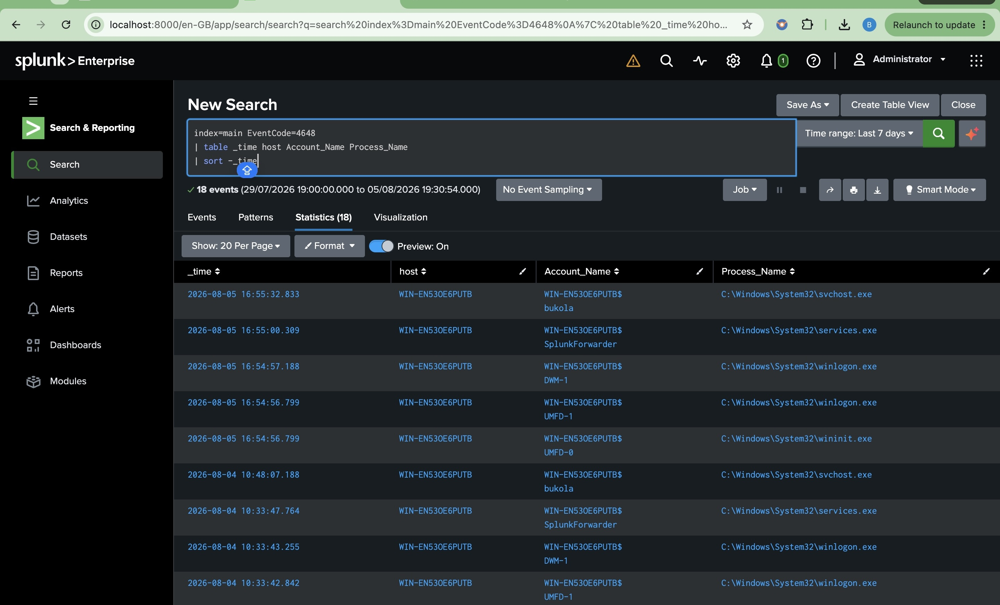
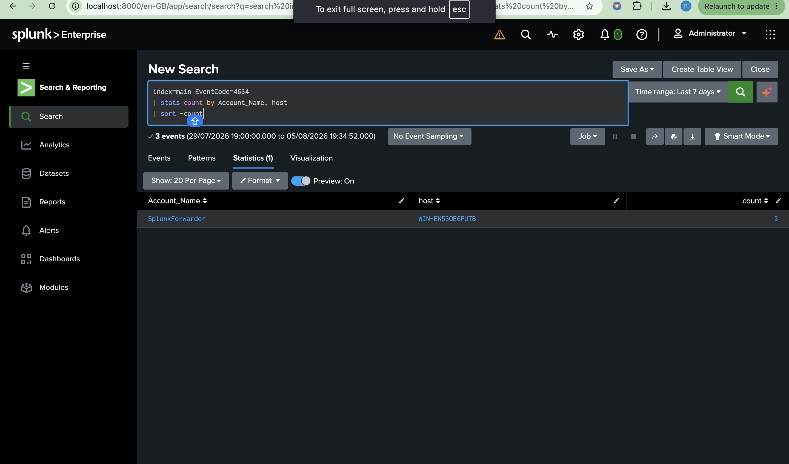

# Detection 1 – Successful Logons (Event ID 4624)

## Detection Objective

Identify successful Windows logons to establish authentication activity, monitor user access patterns, and support security investigations.

---

## SPL Query

```spl
index=main EventCode=4624
| stats count by Account_Name, host, Logon_Type
| sort -count
```

---

## Security Use Case

This detection helps security analysts to:

- Monitor successful user authentication activity
- Establish authentication baselines
- Identify unusual login behavior
- Track user access across monitored endpoints
- Correlate successful logons with other security events

---

## MITRE ATT&CK Mapping

| Technique | ID |
|----------|------|
| Valid Accounts | T1078 |

---

## Investigation Checklist

- Was the login expected?
- Did the login occur during normal business hours?
- Is the account privileged?
- Was there a corresponding Event ID 4634 (Logoff)?
- Was Event ID 4672 (Special Privileges Assigned) generated after the login?

---

## Evidence

The detection was validated by querying successful Windows authentication events (Event ID 4624) collected from the monitored Windows endpoint.

Splunk successfully identified multiple successful logons across different user and system accounts, including logon types and authentication frequency. This demonstrates the ability to establish authentication baselines and monitor legitimate user activity.

### Validation Query

```spl
index=main EventCode=4624
| stats count by Account_Name, host, Logon_Type
| sort -count
```


---

## Outcome

The detection successfully identified successful Windows authentication events from the monitored endpoint. This detection provides visibility into normal user authentication activity and supports threat hunting, user behavior analysis, and incident investigations by establishing authentication baselines.

# Detection 2 – Failed Logons (Event ID 4625)

## Detection Objective

Detect repeated failed Windows authentication attempts that may indicate brute-force attacks, password spraying, or unauthorized login attempts.

---

## SPL Query

```spl
index=main EventCode=4625
| stats count by Account_Name, host
| where count >=5
| sort -count
```

---

## Security Use Case

This detection helps security analysts to:

- Detect brute-force attacks
- Detect password spraying attempts
- Identify repeated authentication failures
- Monitor targeted user accounts
- Support incident response and account compromise investigations

---

## MITRE ATT&CK Mapping

| Technique | ID |
|----------|------|
| Brute Force | T1110 |

---

## Investigation Checklist

- Which account is being targeted?
- Which host generated the failed logons?
- Were the failures followed by a successful logon (Event ID 4624)?
- Is the targeted account privileged?
- Is the number of failed attempts unusual for the environment?

---

## Evidence

The detection was validated by intentionally generating multiple failed authentication attempts on the monitored Windows 11 endpoint.

Splunk successfully identified **seven failed logon events (Event ID 4625)** for the monitored user account, confirming that the detection can identify repeated authentication failures that may indicate brute-force attacks or password guessing.

### Validation Query

```spl
index=main EventCode=4625
| stats count by Account_Name, host
| where count >=5
| sort -count
```


---

## Outcome

The failed logon detection successfully identified repeated authentication failures against the monitored Windows endpoint. This detection enables Security Operations Center (SOC) analysts to identify brute-force attacks, password spraying attempts, and other suspicious authentication activity requiring further investigation. It also provides valuable visibility into account misuse and supports proactive threat detection.

# Detection 3 – Explicit Credentials (Event ID 4648)

## Detection Objective

Detect Windows authentication events where alternate credentials are supplied, helping identify administrative activity, credential misuse, or potential lateral movement.

---

## SPL Query

```spl
index=main EventCode=4648
| table _time host Account_Name Process_Name
| sort -_time
```

---

## Security Use Case

This detection helps security analysts to:

- Detect the use of alternate credentials
- Monitor administrative authentication activity
- Identify potential credential misuse
- Investigate potential lateral movement
- Correlate authentication events during incident investigations

---

## MITRE ATT&CK Mapping

| Technique | ID |
|----------|------|
| Use Alternate Authentication Material | T1550 |

---

## Investigation Checklist

- Which account supplied the credentials?
- Which process initiated the authentication?
- Was the authentication expected?
- Is the account privileged?
- Was the authentication followed by suspicious activity?

---

## Evidence

The detection was validated by searching for Windows Security Event ID **4648** within Splunk.

Splunk successfully identified **18 explicit credential authentication events** generated from the monitored Windows endpoint. The results include the event timestamp, host, account name, and process responsible for the authentication, demonstrating that explicit credential usage is being successfully collected and monitored.

### Validation Query

```spl
index=main EventCode=4648
| table _time host Account_Name Process_Name
| sort -_time
```



---

## Outcome

The explicit credential detection successfully identified Windows authentication events where alternate credentials were used. Monitoring Event ID 4648 provides valuable visibility into administrative authentication activity, credential usage, and potential lateral movement, enabling Security Operations Center (SOC) analysts to investigate suspicious authentication behavior and support incident response activities.

# Detection 4 – User Logoff (Event ID 4634)

## Detection Objective

Monitor Windows user logoff events to track session termination and correlate user logoff activity with successful logons.

---

## SPL Query

```spl
index=main EventCode=4634
| stats count by Account_Name, host
| sort -count
```

---

## Security Use Case

This detection helps security analysts to:

- Monitor user session termination
- Build authentication timelines
- Correlate successful logons with logoff events
- Support forensic investigations
- Identify unusual user session activity

---

## Investigation Checklist

- Was there a corresponding successful logon (Event ID 4624)?
- Was the session duration expected?
- Did the account perform privileged actions before logging off?
- Was the logoff initiated by a user or a system account?
- Is the logoff activity consistent with normal system behavior?

---

## Evidence

The detection was validated by searching for Windows Security Event ID **4634** collected from the monitored Windows endpoint.

Splunk successfully identified **3 user logoff events** associated with the **SplunkForwarder** account on the monitored host. This confirms that Windows session termination events are being collected correctly and can be used to reconstruct authentication timelines during investigations.

### Validation Query

```spl
index=main EventCode=4634
| stats count by Account_Name, host
| sort -count
```

### Screenshot

**user-logoff-detection.jpg**



---

## Outcome

The user logoff detection successfully identified Windows session termination events collected by Splunk. Monitoring Event ID 4634 enables SOC analysts to correlate logon and logoff activity, investigate user sessions, establish authentication timelines, and support incident response and forensic investigations.
