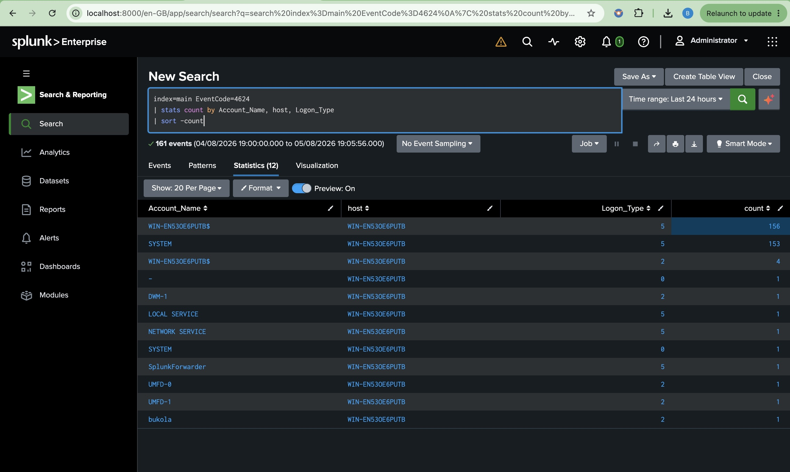
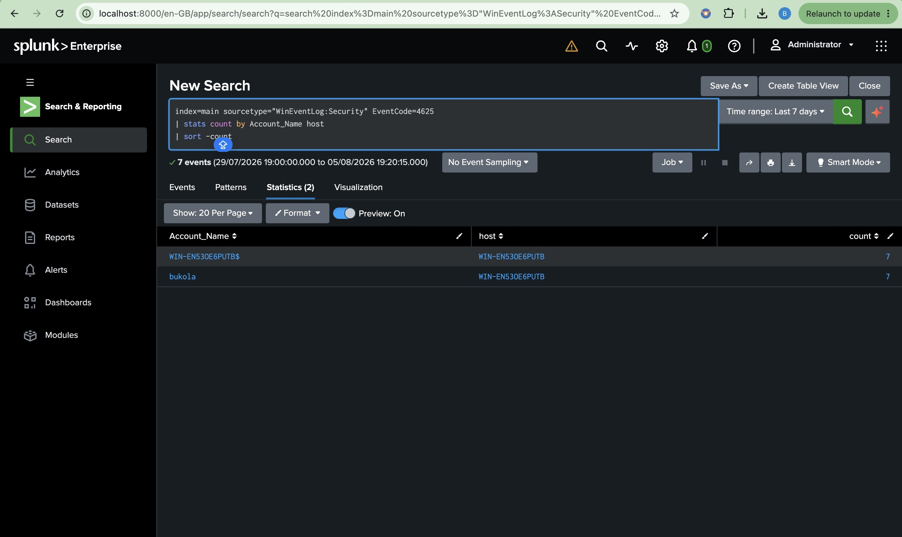

# Detection 1 – Successful Logons (Event ID 4624)

## Detection Objective

Identify successful Windows logons to establish authentication activity, monitor user access patterns, and support security investigations.

---

## SPL Query

```spl
index=main EventCode=4624
| stats count by Account_Name, host, Logon_Type
| sort -count
```

---

## Security Use Case

This detection helps security analysts to:

- Monitor successful user authentication activity
- Establish authentication baselines
- Identify unusual login behavior
- Track user access across monitored endpoints
- Correlate successful logons with other security events

---

## MITRE ATT&CK Mapping

| Technique | ID |
|----------|------|
| Valid Accounts | T1078 |

---

## Investigation Checklist

- Was the login expected?
- Did the login occur during normal business hours?
- Is the account privileged?
- Was there a corresponding Event ID 4634 (Logoff)?
- Was Event ID 4672 (Special Privileges Assigned) generated after the login?

---

## Evidence

The detection was validated by querying successful Windows authentication events (Event ID 4624) collected from the monitored Windows endpoint.

Splunk successfully identified multiple successful logons across different user and system accounts, including logon types and authentication frequency. This demonstrates the ability to establish authentication baselines and monitor legitimate user activity.

### Validation Query

```spl
index=main EventCode=4624
| stats count by Account_Name, host, Logon_Type
| sort -count
```



---

## Outcome

The detection successfully identified successful Windows authentication events from the monitored endpoint. This detection provides visibility into normal user authentication activity and supports threat hunting, user behavior analysis, and incident investigations by establishing authentication baselines.

# Detection 2 – Failed Logons (Event ID 4625)

## Detection Objective

Detect repeated failed Windows authentication attempts that may indicate brute-force attacks, password spraying, or unauthorized login attempts.

---

## SPL Query

```spl
index=main EventCode=4625
| stats count by Account_Name, host
| where count >=5
| sort -count
```

---

## Security Use Case

This detection helps security analysts to:

- Detect brute-force attacks
- Detect password spraying attempts
- Identify repeated authentication failures
- Monitor targeted user accounts
- Support incident response and account compromise investigations

---

## MITRE ATT&CK Mapping

| Technique | ID |
|----------|------|
| Brute Force | T1110 |

---

## Investigation Checklist

- Which account is being targeted?
- Which host generated the failed logons?
- Were the failures followed by a successful logon (Event ID 4624)?
- Is the targeted account privileged?
- Is the number of failed attempts unusual for the environment?

---

## Evidence

The detection was validated by intentionally generating multiple failed authentication attempts on the monitored Windows 11 endpoint.

Splunk successfully identified **seven failed logon events (Event ID 4625)** for the monitored user account, confirming that the detection can identify repeated authentication failures that may indicate brute-force attacks or password guessing.

### Validation Query

```spl
index=main EventCode=4625
| stats count by Account_Name, host
| where count >=5
| sort -count
```



---

## Outcome

The failed logon detection successfully identified repeated authentication failures against the monitored Windows endpoint. This detection enables Security Operations Center (SOC) analysts to identify brute-force attacks, password spraying attempts, and other suspicious authentication activity requiring further investigation. It also provides valuable visibility into account misuse and supports proactive threat detection.
