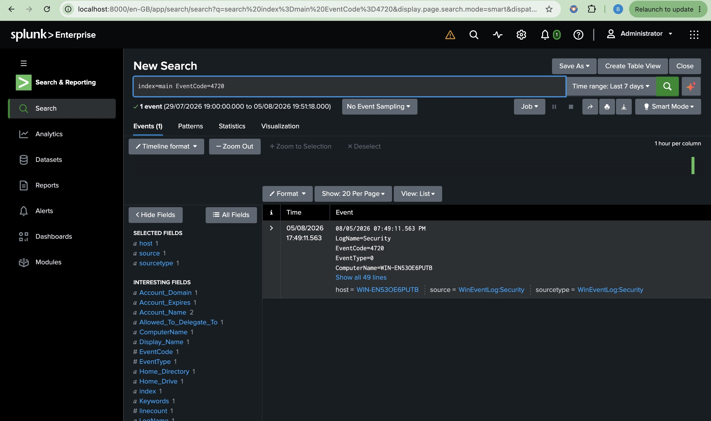
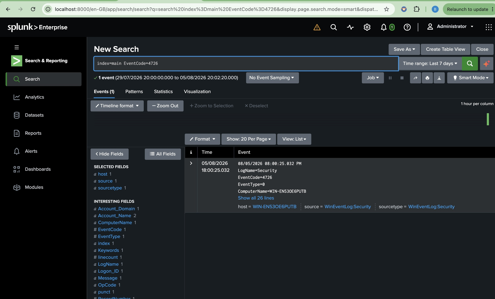

# Phase 7 – Account Management Monitoring

## Overview

This phase focused on monitoring Windows account management events using Splunk Enterprise. Security detections were created to identify user account creation, deletion, modification, and lockout events.

## Objectives

- Monitor user account creation
- Monitor user account deletion
- Detect account lockouts
- Track account modifications
- Validate detections using real Windows Security Events

## Activities Performed

- Created a temporary local user account
- Verified Event ID 4720 in Event Viewer
- Confirmed Event ID 4720 was forwarded to Splunk
- Created an SPL detection query
- Captured validation screenshots

## Results

- Successfully collected Event ID 4720
- Validated account creation monitoring
- Confirmed Windows Security logs were indexed in Splunk




# Detection 2 – User Account Deleted (Event ID 4726)

## Detection Objective

Detect the deletion of local user accounts to identify unauthorized account removal, malicious cleanup activity, or administrative account management operations.

## SPL Query

```spl
index=main EventCode=4726
```

## Security Use Case

- Monitor user account deletion
- Detect unauthorized account removal
- Identify attempts to remove evidence or persistence
- Support security auditing and compliance

## MITRE ATT&CK

| Technique | ID |
|-----------|----|
| Create Account (Account Deletion) | T1136 |

## Investigation Checklist

- Which user account was deleted?
- Who deleted the account?
- Was the deletion authorized?
- Was the account privileged?
- Were any related administrative actions performed before or after the deletion?

## Validation

A temporary local user account named **splunktest** was deleted from the monitored Windows 11 endpoint using the Local Users and Groups management console.

Splunk successfully collected **Windows Security Event ID 4726**, confirming that user account deletion events were forwarded and indexed in near real time.

## Evidence

**Validation Query**

```spl
index=main EventCode=4726
```

**Screenshot**

`phase-7-account-deleted-detection.jpg`


## Outcome

The detection successfully identified the deletion of a local Windows user account. This validates Splunk's ability to monitor account removal activities and provides visibility into potentially unauthorized account deletion events that may indicate attempts to remove user access, erase evidence, or maintain persistence within an environment.
