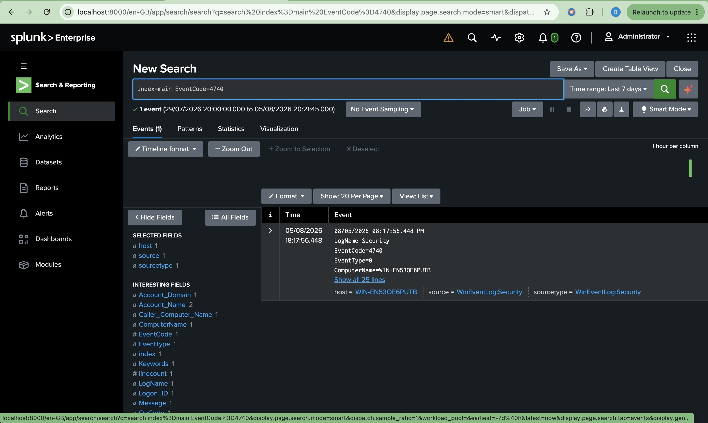
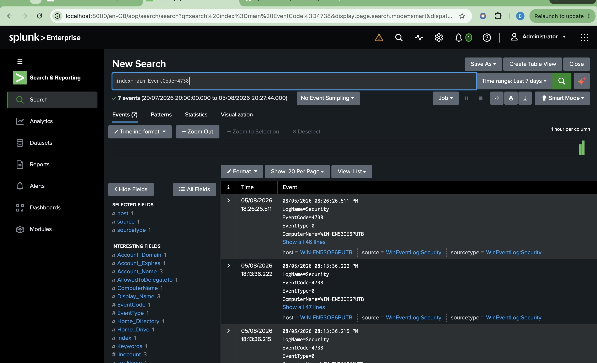

# Phase 7 – Account Management Monitoring

# Detection 1 – User Account Created (Event ID 4720)

## Overview

This phase focused on monitoring Windows account management events using Splunk Enterprise. Security detections were created to identify user account creation, deletion, modification, and lockout events.

## Objectives

- Monitor user account creation
- Monitor user account deletion
- Detect account lockouts
- Track account modifications
- Validate detections using real Windows Security Events

## Activities Performed

- Created a temporary local user account
- Verified Event ID 4720 in Event Viewer
- Confirmed Event ID 4720 was forwarded to Splunk
- Created an SPL detection query
- Captured validation screenshots

## Results

- Successfully collected Event ID 4720
- Validated account creation monitoring
- Confirmed Windows Security logs were indexed in Splunk


# Detection 2 – User Account Deleted (Event ID 4726)

## Detection Objective

Detect the deletion of local user accounts to identify unauthorized account removal, malicious cleanup activity, or administrative account management operations.

## SPL Query

```spl
index=main EventCode=4726
```

## Security Use Case

- Monitor user account deletion
- Detect unauthorized account removal
- Identify attempts to remove evidence or persistence
- Support security auditing and compliance

## MITRE ATT&CK

| Technique | ID |
|-----------|----|
| Create Account (Account Deletion) | T1136 |

## Investigation Checklist

- Which user account was deleted?
- Who deleted the account?
- Was the deletion authorized?
- Was the account privileged?
- Were any related administrative actions performed before or after the deletion?

## Validation

A temporary local user account named **splunktest** was deleted from the monitored Windows 11 endpoint using the Local Users and Groups management console.

Splunk successfully collected **Windows Security Event ID 4726**, confirming that user account deletion events were forwarded and indexed in near real time.

## Evidence

**Validation Query**

```spl
index=main EventCode=4726
```


## Outcome

The detection successfully identified the deletion of a local Windows user account. This validates Splunk's ability to monitor account removal activities and provides visibility into potentially unauthorized account deletion events that may indicate attempts to remove user access, erase evidence, or maintain persistence within an environment.

# Detection 3 – User Account Locked Out (Event ID 4740)

## Detection Objective

Detect user account lockout events that may indicate brute-force attacks, password spraying, or repeated failed authentication attempts.

## SPL Query

```spl
index=main EventCode=4740
```

## Security Use Case

- Detect account lockout events
- Identify brute-force attacks
- Detect password spraying attempts
- Monitor suspicious authentication activity
- Support incident response investigations

## MITRE ATT&CK

| Technique | ID |
|-----------|----|
| Brute Force | T1110 |

## Investigation Checklist

- Which user account was locked?
- Which system generated the lockout?
- Were there multiple failed logon attempts (Event ID 4625) before the lockout?
- Was the activity expected?
- Is the affected account privileged?

## Validation

A temporary local user account named **lockouttest** was intentionally locked by entering an incorrect password multiple times until the Windows account lockout threshold was reached.

Splunk successfully collected **Windows Security Event ID 4740**, confirming that account lockout events were forwarded and indexed in near real time.

## Evidence

**Validation Query**

```spl
index=main EventCode=4740
```



## Outcome

The detection successfully identified a Windows account lockout event after repeated failed authentication attempts. This validates Splunk's ability to detect potential brute-force attacks and provides visibility into suspicious authentication activity that may require further investigation.

# Detection 4 – User Account Changed (Event ID 4738)

## Detection Objective

Detect modifications to existing user accounts to identify unauthorized account changes, privilege abuse, or suspicious administrative activity.

## SPL Query

```spl
index=main EventCode=4738
```

## Security Use Case

- Monitor user account modifications
- Detect unauthorized account changes
- Identify suspicious administrative activity
- Support security auditing and compliance

## MITRE ATT&CK

| Technique | ID |
|-----------|----|
| Account Manipulation | T1098 |

## Investigation Checklist

- Which user account was modified?
- What account attribute was changed?
- Who performed the modification?
- Was the change authorized?
- Were any privileged groups affected?

## Validation

The **lockouttest** account was modified by updating its account properties using the Windows Local Users and Groups management console.

Splunk successfully collected **Windows Security Event ID 4738**, confirming that account modification events were forwarded and indexed in near real time.

## Evidence

**Validation Query**

```spl
index=main EventCode=4738
```



## Outcome

The detection successfully identified a user account modification event. This validates Splunk's ability to monitor account changes and provides visibility into administrative actions that could indicate unauthorized account manipulation or privilege abuse.
