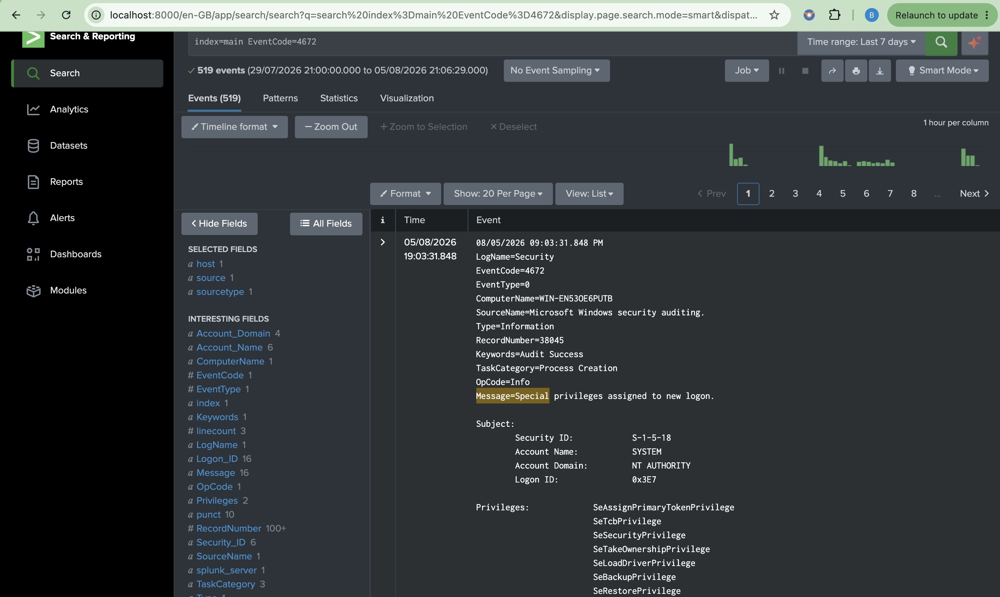
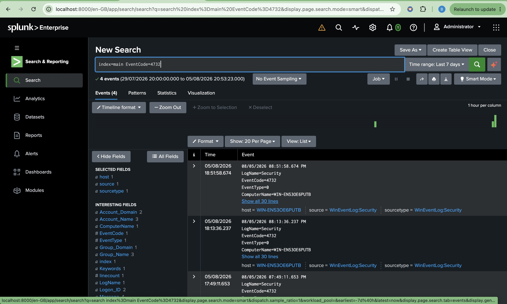
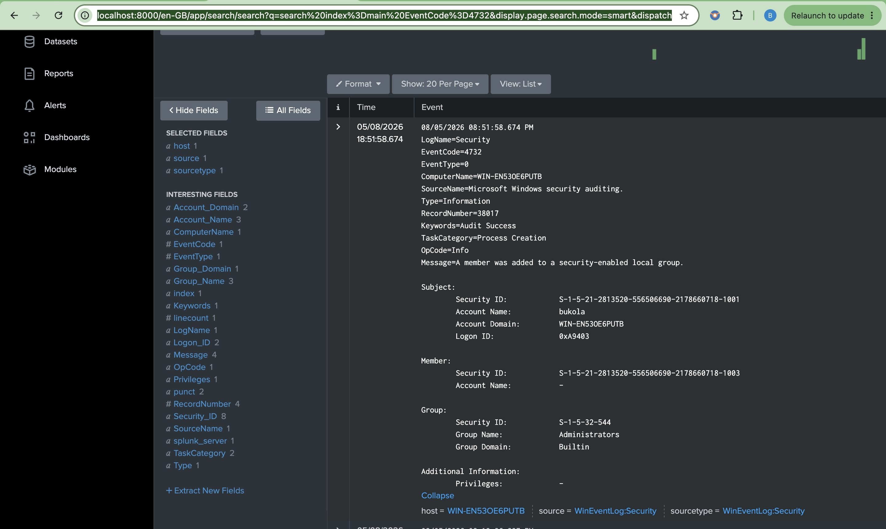

# Detection 1 – Special Privileges Assigned to New Logon (Event ID 4672)

## Detection Objective

Detect successful logons where Windows assigns administrative or elevated privileges to a user account. This detection helps identify privileged account usage that could indicate administrative activity or potential privilege escalation.

## SPL Query

```spl
index=main EventCode=4672
```

## Security Use Case

- Monitor privileged logons
- Detect administrative account usage
- Identify privileged sessions
- Support privilege escalation investigations
- Establish administrative activity baselines

## MITRE ATT&CK

| Technique | ID |
|-----------|----|
| Valid Accounts | T1078 |
| Abuse Elevation Control Mechanism | T1548 |

## Investigation Checklist

- Which account received special privileges?
- Is the account expected to have administrative access?
- Did the privileged logon occur during normal business hours?
- Was the logon followed by administrative actions?
- Did the source host match expected administrator activity?

## Validation

A privileged Windows account logged on to the monitored endpoint, generating Windows Security Event ID 4672.

Splunk successfully collected and indexed the event, confirming that privileged logons are monitored and available for security investigations.

## Evidence

**Validation Query**

```spl
index=main EventCode=4672
```

**Screenshot**



## Outcome

The detection successfully identified privileged logon activity by monitoring Windows Security Event ID 4672. This provides visibility into administrative account usage and enables security analysts to detect unexpected privileged sessions that may indicate privilege escalation or unauthorized administrative access.

# Detection 2 – User Added to Local Security Group (Event ID 4732)

## Detection Objective

Detect when a user account is added to a security-enabled local group. This detection helps identify privilege escalation, unauthorized administrative changes, and modifications to privileged group memberships.

## SPL Query

```spl
index=main EventCode=4732
```

## Security Use Case

- Detect users added to privileged groups
- Monitor administrative changes
- Identify privilege escalation attempts
- Audit changes to local security groups
- Support incident response investigations

## MITRE ATT&CK

| Technique | ID |
|-----------|----|
| Account Manipulation | T1098 |

## Investigation Checklist

- Which user was added to the group?
- Which security group was modified?
- Who performed the action?
- Was the change approved?
- Is the affected group privileged (e.g., Administrators)?

## Validation

The **lockouttest** account was intentionally added to the local **Administrators** group using the Windows Local Users and Groups management console.

Splunk successfully collected **Windows Security Event ID 4732**, confirming that security group membership changes were forwarded and indexed in near real time.

## Evidence

### Validation Query

```spl
index=main EventCode=4732
```

### Detection Screenshot



### Evidence Screenshot



## Outcome

The detection successfully identified a user being added to the local **Administrators** group. The event captured the user performing the action, the affected security group, and the target account, demonstrating Splunk's ability to detect administrative group membership changes that may indicate privilege escalation or unauthorized access.
